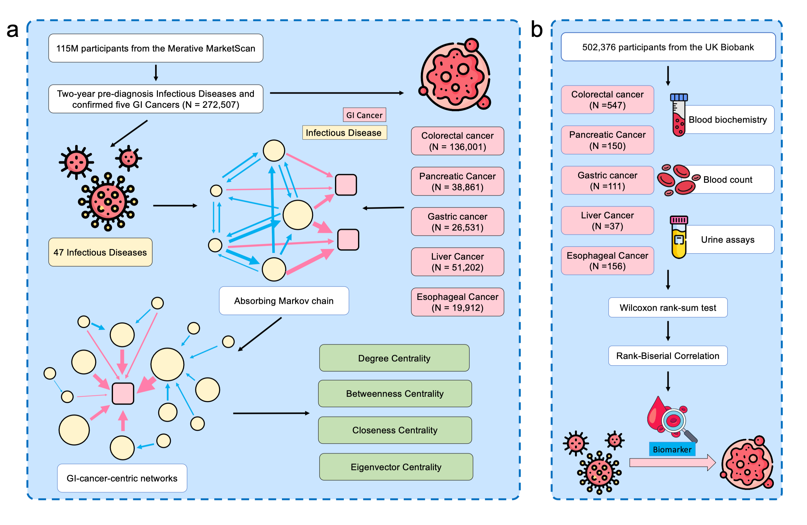

# Network-Based Markov Modeling of Infectious Disease Progression to Gastrointestinal Cancers

**Using electronic medical records, we applied Markov chain modeling to characterize transition patterns between 47 infectious diseases and five gastrointestinal cancers (gastric, colorectal, liver, esophageal, and pancreatic). Transition networks identified 25 direct and four multi-step infection-to-cancer pathways. Centrality analysis highlighted key infection hubs and bridges, including fungal infections, UTI, acute bronchitis, HBV/HCV, and H. pylori, which play major roles in driving and mediating cancer transitions. Biomarker analysis further revealed significant differences in blood, biochemical, and urinary indicators between cancer cases and controls, suggesting potential early risk signals. Data access is subject to approval; requests should be directed to the corresponding database administrators.**

1. `MarketScan_ICD_data_process.py`

   **MarketScan ICD Data Preprocessing.** Specifically designed to clean and process ICD (International Classification of Diseases) code data from the MarketScan database, preparing structured input for subsequent analyses.

2. data_preprocess_for_R_analysis.py

   **Data Preprocessing for R Analysis.** Performs final data tidying and format conversion, ensuring the data structure is compliant with R scripts for statistical analysis.

3. `Constructing Markov Chain, Network Centrality Analysis, and Biomarkers Rank-Biserial Correlation.R`

   **Core Analysis Module: Markov Chain, Network Centrality, and Biomarker Association.** Includes the construction of the infectious diseases to GI cancer Markov chain, centrality analysis to identify key transition patterns, and rank-biserial correlation analysis for distinguishing early cancer risk biomarkers.

4. `Directed Weighted Network.R`

   **Directed Weighted Network Construction for Cancer Transition.** Generates and visualizes the network topology graph of disease state evolution and their probabilities, integrating both direct and multi-step transition probabilities to show cancer progression pathways and intensity.

5. `Network Centrality Plots.ipynb`

   **Network Centrality Metrics Visualization.** Calculates and visualizes various key centrality measures (e.g., degree, betweenness, closeness centrality) within the network (graph), used for in-depth structural analysis and identification of critical nodes in the disease progression pathway.

6. `Biomarkers Forestplot.R`

   **Biomarkers Forest Plot Generation.** Automatically generates and saves a Forest Plot for each specific cancer type in the dataset. This plot visually displays the rank-biserial correlation coefficient $r$ and its 95% Confidence Interval (CI) between different biomarkers and the Transition to Cancer pathway.

7. `Disease and Cancer Transition Martix Heatmap.R`

   **Disease and Cancer Transition Matrix Heatmap Visualization.** Reads and processes the state transition probability data between diseases and cancer, then generates and saves a **Heatmap** to visually represent the probability and pattern of mutual transitions between different states.