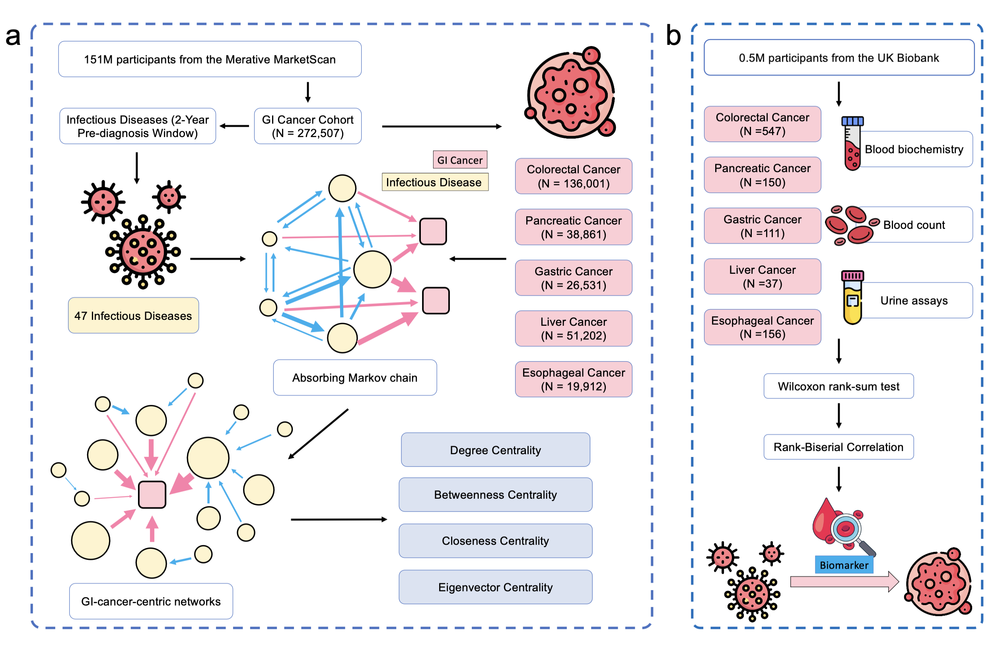

# Network-Based Markov Modeling of Infectious Disease Progression to Gastrointestinal Cancers

**Infections are recognized early risk factors for gastrointestinal (GI) cancers, yet their transition pathways remain fragmented. By analyzing electronic medical records with Markov chain modeling, we mapped the progression among 47 infectious diseases and five major GI cancers (gastric, colorectal, liver, esophageal, and pancreatic), revealing structured networks. We identified 25 imminent infections (*e.g.*, *H. pylori* and parasitic infections) and four transition routes (*e.g.*, bacterial infection-urinary tract infection, UTI) shared by all five GI cancers, as well as four cancer-specific imminent infections (*e.g.*, cellulitis specific to colorectal cancer and Hepatitis B to gastric cancer) and 28 transition routes (*e.g.*, spirochetal infection-gastrointestinal infection-gastric cancer). Centrality analysis revealed that acute bronchitis, acute upper respiratory infection, fungal infections, cellulitis, and UTI (as high-degree centrality nodes) directly link to all five GI cancers; *H. pylori*, fungal infections, and UTI (high-eigenvector centrality) exert broad network influence for pancreatic, gastric, and esophageal cancers; Hepatitis C infection (high-closeness centrality) drive rapid progression for all five GI cancers except for esophageal cancer; and fungal infections, acute bronchitis, and UTI (high-betweenness centrality) mediate infection-to-cancer transitions and pro-cancer co-infections for all five GI cancers. Further, we identified clinical biomarkers that inform whether an infection’s transition to a GI cancer would happen: leukocyte counts at GI infections-to-pancreatic cancer transition, sex hormone–binding globulin in fungal infections-to-esophageal cancer, and urinary sodium in upper respiratory infections-to-colorectal cancer. These biomarkers may act as carcinogenic mediators, progressive indicators, or actionable risk factors, advancing our mechanistic understanding of infection-induced GI carcinogenesis (implemented as an interactive web portal at http://infect2gi.org.cn/).**

1. `MarketScan_ICD_data_process.py`

   **MarketScan ICD Data Preprocessing.** Specifically designed to clean and process ICD (International Classification of Diseases) code data from the MarketScan database, preparing structured input for subsequent analyses.

2. data_preprocess_for_R_analysis.py

   **Data Preprocessing for R Analysis.** Performs final data tidying and format conversion, ensuring the data structure is compliant with R scripts for statistical analysis.

3. `Constructing Markov Chain, Network Centrality Analysis, and Biomarkers Rank-Biserial Correlation.R`

   **Core Analysis Module: Markov Chain, Network Centrality, and Biomarker Association.** Includes the construction of the infectious diseases to GI cancer Markov chain, centrality analysis to identify key transition patterns, and rank-biserial correlation analysis for distinguishing early cancer risk biomarkers.

4. `Directed Weighted Network.R`

   **Directed Weighted Network Construction for Cancer Transition.** Generates and visualizes the network topology graph of disease state evolution and their probabilities, integrating both direct and multi-step transition probabilities to show cancer progression pathways and intensity.

5. `Network Centrality Plots.ipynb`

   **Network Centrality Metrics Visualization.** Calculates and visualizes various key centrality measures (e.g., degree, betweenness, closeness centrality) within the network (graph), used for in-depth structural analysis and identification of critical nodes in the disease progression pathway.

6. `Biomarkers Forestplot.R`

   **Biomarkers Forest Plot Generation.** Automatically generates and saves a Forest Plot for each specific cancer type in the dataset. This plot visually displays the rank-biserial correlation coefficient $r$ and its 95% Confidence Interval (CI) between different biomarkers and the Transition to Cancer pathway.

7. `Disease and Cancer Transition Martix Heatmap.R`

   **Disease and Cancer Transition Matrix Heatmap Visualization.** Reads and processes the state transition probability data between diseases and cancer, then generates and saves a **Heatmap** to visually represent the probability and pattern of mutual transitions between different states.

   

**Data access is subject to approval; requests should be directed to the corresponding database administrators.**